# 📊 Rapport : Processus ETL et Data Warehouse SmartRide
 

---

## 📑 Table des Matières

1. [Introduction et Contexte](#1-introduction-et-contexte)
2. [Architecture Globale du Système BI](#2-architecture-globale-du-système-bi)
3. [Processus ETL (Extract, Transform, Load)](#3-processus-etl-extract-transform-load)
4. [Modèle en Étoile (Star Schema)](#4-modèle-en-étoile-star-schema)
5. [Structure du Data Warehouse](#5-structure-du-data-warehouse)
6. [KPIs et Indicateurs Clés](#6-kpis-et-indicateurs-clés)
7. [Conclusion](#7-conclusion)

---

## 1. Introduction et Contexte

### 1.1 Présentation du Projet

**SmartRide** est une plateforme de covoiturage intelligente permettant de connecter conducteurs et passagers en Tunisie. Ce rapport documente la mise en place d'un système décisionnel complet comprenant :

- Un processus **ETL** (Extract, Transform, Load)
- Un **Data Warehouse** basé sur un modèle en étoile
- Des **KPIs** pour le suivi de la performance


### 1.2 Source de Données

| Attribut | Valeur |
|----------|--------|
| **Fichier source** | `smartride_events_2025.csv` |
| **Période** | Janvier - Décembre 2025 |
| **Nombre d'événements** | ~10,697 |
| **Types d'événements** | `trip_published`, `reservation_created`, `reservation_cancelled` |

---

## 2. Architecture Globale du Système BI

### 2.1 Flux de Données

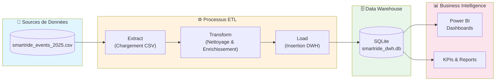

### 2.2 Stack Technologique

| Composant | Technologie | Description |
|-----------|-------------|-------------|
| **Langage** | Python 3.12 | Traitement des données |
| **Librairies** | Pandas, NumPy | Manipulation des données |
| **Base de données** | SQLite | Stockage du Data Warehouse |
| **Visualisation** | Matplotlib, Seaborn | Graphiques exploratoires |
| **BI Tool** | Power BI | Tableaux de bord interactifs |

---

## 3. Processus ETL (Extract, Transform, Load)

### 3.1 Vue d'Ensemble du Pipeline ETL

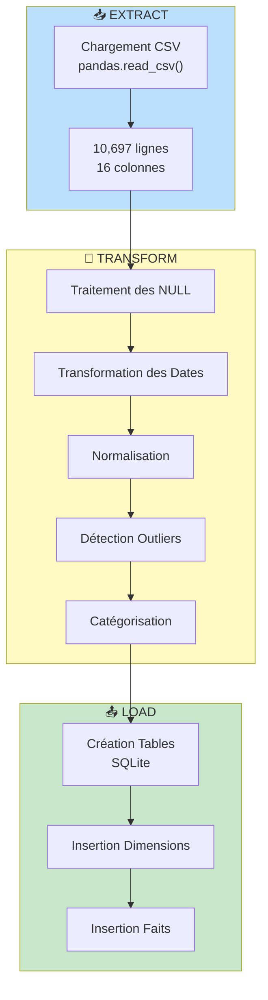

### 3.2 Étape 1 : Extraction (Extract)

**Objectif** : Charger les données brutes depuis le fichier CSV.

```python
df = pd.read_csv('data/raw/smartride_events_2025.csv')
```

**Colonnes du Dataset Source** :

| Colonne | Type | Description |
|---------|------|-------------|
| `event_id` | String | Identifiant unique de l'événement |
| `event_type` | String | Type d'événement |
| `event_ts` | DateTime | Timestamp de l'événement |
| `trip_id` | String | Identifiant du trajet |
| `driver_id` | String | Identifiant du conducteur |
| `driver_name` | String | Nom du conducteur |
| `passenger_id` | String | Identifiant du passager (nullable) |
| `passenger_name` | String | Nom du passager (nullable) |
| `departure_city` | String | Ville de départ |
| `destination_city` | String | Ville de destination |
| `price_per_seat` | Float | Prix par siège (TND) |
| `seats_total` | Integer | Nombre total de sièges |
| `seats_change` | Integer | Changement de sièges |
| `reservation_id` | String | ID de réservation (nullable) |
| `reservation_status` | String | Statut de réservation (nullable) |

### 3.3 Étape 2 : Transformation (Transform)

#### 3.3.1 Traitement des Valeurs Manquantes (NULL)

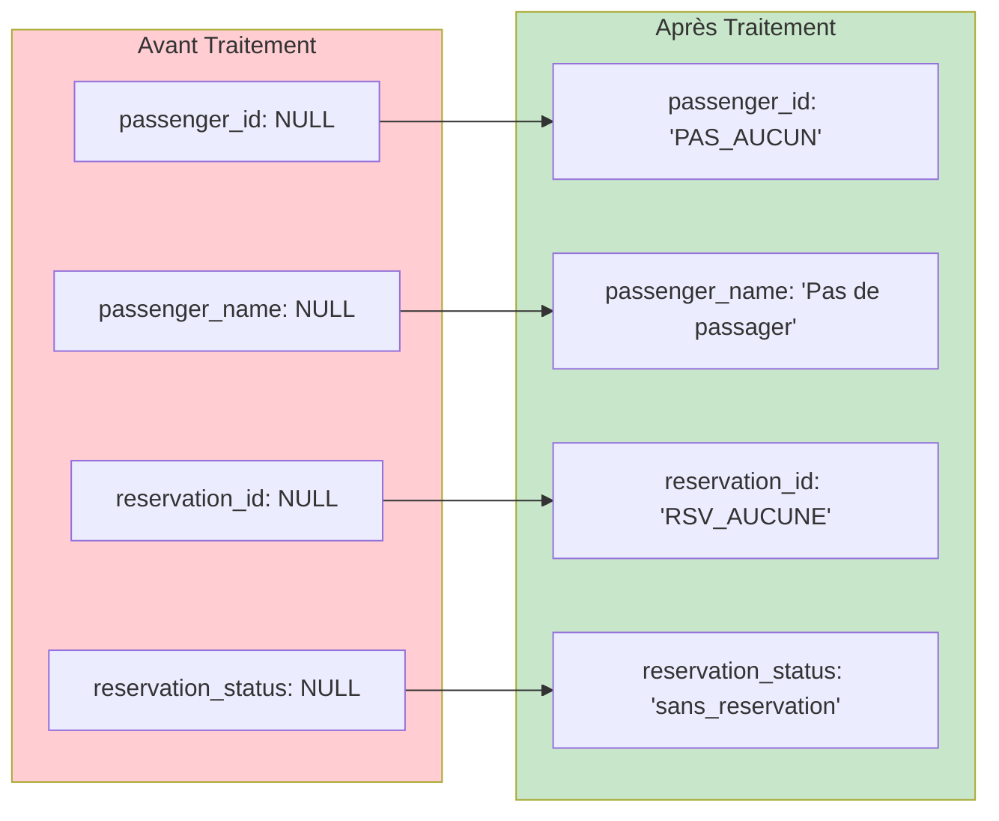

**Logique** : Les valeurs NULL sont normales pour les événements `trip_published` (pas encore de passager).

#### 3.3.2 Transformation des Dates

Création de colonnes temporelles pour l'analyse :

| Colonne Créée | Description | Exemple |
|---------------|-------------|---------|
| `annee` | Année | 2025 |
| `mois` | Mois (1-12) | 6 |
| `jour` | Jour du mois | 15 |
| `heure` | Heure (0-23) | 14 |
| `trimestre` | Trimestre (1-4) | 2 |
| `trimestre_label` | Label trimestre | "T2" |
| `mois_nom` | Nom du mois | "June" |
| `jour_semaine` | Jour de la semaine | "Monday" |
| `periode_journee` | Période | "Après-midi" |

**Catégorisation des Périodes de la Journée** :

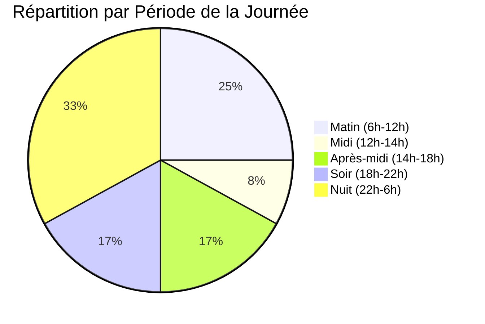

#### 3.3.3 Normalisation des Données

- **Noms** : Conversion en majuscules (UPPER CASE)
- **Routes** : Création du format `Départ → Destination`
- **Catégories de prix** :

| Catégorie | Plage de Prix (TND) |
|-----------|---------------------|
| Économique | ≤ 10 |
| Standard | 11 - 20 |
| Premium | 21 - 30 |
| Luxe | > 30 |

#### 3.3.4 Détection des Outliers (Méthode IQR)

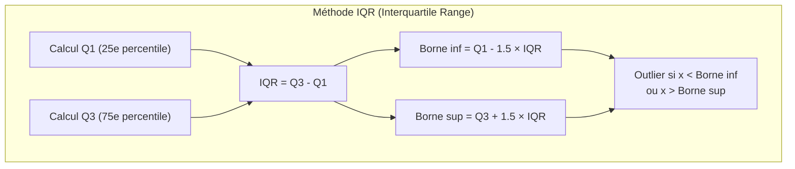

**Résultats de la Détection** :

| Variable | Q1 | Q3 | IQR | Bornes | Outliers |
|----------|----|----|-----|--------|----------|
| `price_per_seat` | 10.1 | 25.2 | 15.1 | [-12.6, 47.9] | ~0% |
| `seats_total` | 3 | 4 | 1 | [1.5, 5.5] | ~0% |
| `seats_change` | -1 | 0 | 1 | [-2.5, 1.5] | ~0% |

### 3.4 Étape 3 : Chargement (Load)

**Base de données cible** : `data/processed/smartride_dwh.db` (SQLite)

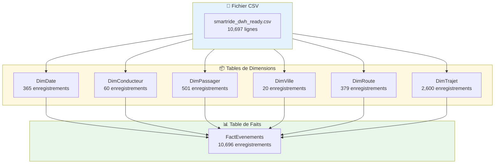

---

## 4. Modèle en Étoile (Star Schema)

### 4.1 Concept du Modèle en Étoile

Le **modèle en étoile** est une architecture de Data Warehouse où :
- Une **table de faits** centrale contient les mesures (métriques)
- Des **tables de dimensions** entourent la table de faits et fournissent le contexte

### 4.2 Schéma du Data Warehouse SmartRide

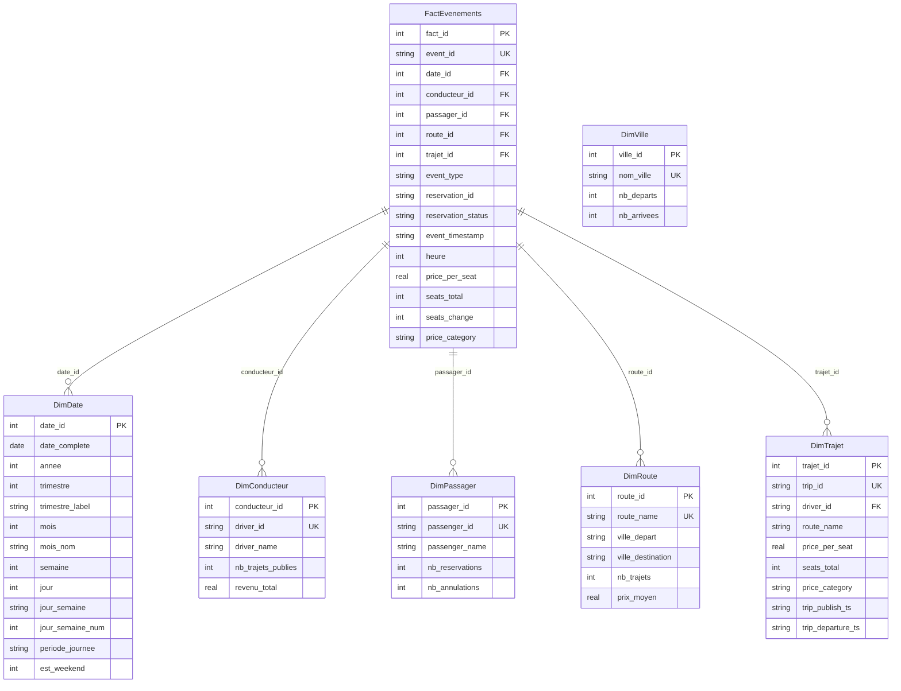

### 4.3 Avantages du Modèle en Étoile

| Avantage | Description |
|----------|-------------|
| **Simplicité** | Structure facile à comprendre et à interroger |
| **Performance** | Jointures simples entre faits et dimensions |
| **Flexibilité** | Facile d'ajouter de nouvelles dimensions |
| **Compatibilité BI** | Optimisé pour les outils comme Power BI |

### 4.4 Clés de Substitution (Surrogate Keys)

Les **clés de substitution** (surrogate keys) sont des identifiants numériques générés automatiquement :

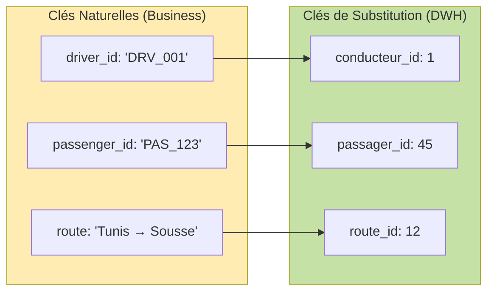

**Pourquoi utiliser des clés de substitution ?**
- ✅ Jointures plus rapides (INTEGER vs TEXT)
- ✅ Indépendance vis-à-vis des systèmes sources
- ✅ Gestion des changements historiques (SCD)
- ✅ Meilleure performance des index

---

## 5. Structure du Data Warehouse

### 5.1 Tables de Dimensions

#### 5.1.1 DimDate (Dimension Temporelle)

| Colonne | Type | Description |
|---------|------|-------------|
| `date_id` | INTEGER | Clé primaire (surrogate key) |
| `date_complete` | DATE | Date complète (UNIQUE) |
| `annee` | INTEGER | Année (2025) |
| `trimestre` | INTEGER | Trimestre (1-4) |
| `trimestre_label` | TEXT | Label (T1, T2, T3, T4) |
| `mois` | INTEGER | Mois (1-12) |
| `mois_nom` | TEXT | Nom du mois (January, ...) |
| `semaine` | INTEGER | Semaine de l'année |
| `jour` | INTEGER | Jour du mois |
| `jour_semaine` | TEXT | Nom du jour |
| `jour_semaine_num` | INTEGER | Numéro du jour (0=Lundi) |
| `periode_journee` | TEXT | Période de la journée |
| `est_weekend` | INTEGER | Flag weekend (0/1) |

**Statistiques** : 365 enregistrements (1 par jour de 2025)

#### 5.1.2 DimConducteur

| Colonne | Type | Description |
|---------|------|-------------|
| `conducteur_id` | INTEGER | Clé primaire (surrogate key) |
| `driver_id` | TEXT | ID business du conducteur (UNIQUE) |
| `driver_name` | TEXT | Nom du conducteur |
| `nb_trajets_publies` | INTEGER | Nombre de trajets publiés |
| `revenu_total` | REAL | Revenu total généré (TND) |

**Statistiques** : 60 conducteurs actifs

#### 5.1.3 DimPassager

| Colonne | Type | Description |
|---------|------|-------------|
| `passager_id` | INTEGER | Clé primaire (surrogate key) |
| `passenger_id` | TEXT | ID business du passager (UNIQUE) |
| `passenger_name` | TEXT | Nom du passager |
| `nb_reservations` | INTEGER | Nombre de réservations |
| `nb_annulations` | INTEGER | Nombre d'annulations |

**Statistiques** : 501 passagers (incluant 'PAS_AUCUN' pour les événements sans passager)

#### 5.1.4 DimVille

| Colonne | Type | Description |
|---------|------|-------------|
| `ville_id` | INTEGER | Clé primaire (surrogate key) |
| `nom_ville` | TEXT | Nom de la ville (UNIQUE) |
| `nb_departs` | INTEGER | Nombre de départs |
| `nb_arrivees` | INTEGER | Nombre d'arrivées |

**Statistiques** : 20 villes tunisiennes

#### 5.1.5 DimRoute

| Colonne | Type | Description |
|---------|------|-------------|
| `route_id` | INTEGER | Clé primaire (surrogate key) |
| `route_name` | TEXT | Nom de la route (UNIQUE) |
| `ville_depart` | TEXT | Ville de départ |
| `ville_destination` | TEXT | Ville de destination |
| `nb_trajets` | INTEGER | Nombre de trajets sur cette route |
| `prix_moyen` | REAL | Prix moyen (TND) |

**Statistiques** : 379 routes uniques

#### 5.1.6 DimTrajet

| Colonne | Type | Description |
|---------|------|-------------|
| `trajet_id` | INTEGER | Clé primaire (surrogate key) |
| `trip_id` | TEXT | ID business du trajet (UNIQUE) |
| `driver_id` | TEXT | ID du conducteur (FK) |
| `route_name` | TEXT | Nom de la route |
| `price_per_seat` | REAL | Prix par siège |
| `seats_total` | INTEGER | Nombre de sièges |
| `price_category` | TEXT | Catégorie de prix |
| `trip_publish_ts` | TEXT | Date de publication |
| `trip_departure_ts` | TEXT | Date de départ |

**Statistiques** : 2,600 trajets uniques

### 5.2 Table de Faits : FactEvenements

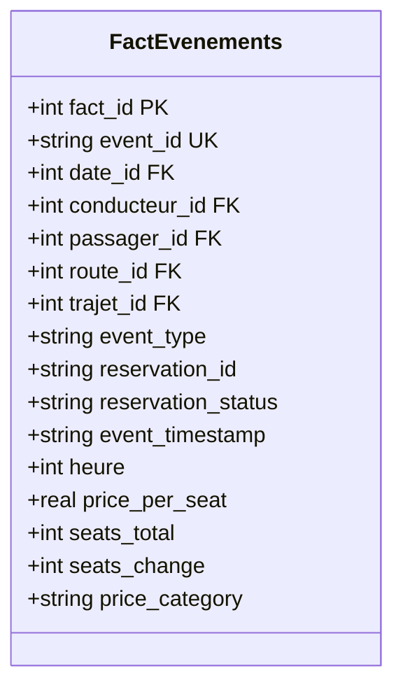

**Caractéristiques** :
- **10,696 enregistrements** (événements)
- **5 clés étrangères** vers les dimensions (surrogate keys)
- **Contraintes NOT NULL** sur toutes les colonnes
- **Mesures** : price_per_seat, seats_total, seats_change

### 5.3 Résumé des Tables

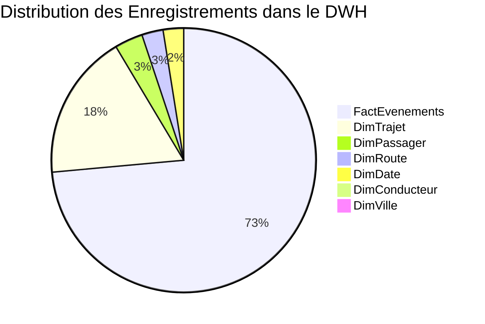

| Table | Type | Enregistrements | Description |
|-------|------|-----------------|-------------|
| **FactEvenements** | FAIT | 10,696 | Événements de covoiturage |
| **DimDate** | DIM | 365 | Calendrier 2025 |
| **DimConducteur** | DIM | 60 | Conducteurs actifs |
| **DimPassager** | DIM | 501 | Passagers (+ PAS_AUCUN) |
| **DimVille** | DIM | 20 | Villes tunisiennes |
| **DimRoute** | DIM | 379 | Routes Départ → Destination |
| **DimTrajet** | DIM | 2,600 | Trajets publiés |

---

## 6. KPIs et Indicateurs Clés

### 6.1 KPIs Globaux

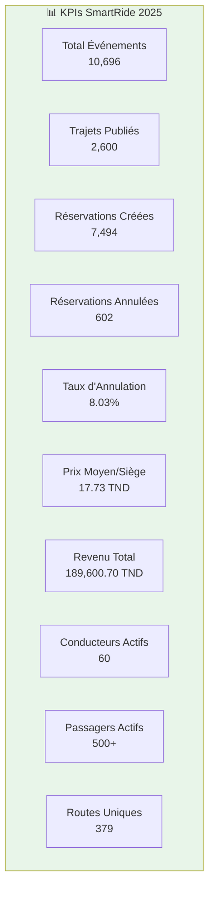

### 6.2 Tableau des KPIs

| # | KPI | Valeur | Description |
|---|-----|--------|-------------|
| 1 | Total Événements | **10,696** | Nombre total d'événements enregistrés |
| 2 | Trajets Publiés | **2,600** | Nombre de trajets publiés par les conducteurs |
| 3 | Réservations Créées | **7,494** | Nombre de réservations effectuées |
| 4 | Réservations Annulées | **602** | Nombre de réservations annulées |
| 5 | Taux d'Annulation | **8.03%** | Ratio annulations / réservations |
| 6 | Prix Moyen par Siège | **17.73 TND** | Prix moyen d'un siège |
| 7 | Revenu Total Estimé | **189,600.70 TND** | Revenu total généré |
| 8 | Conducteurs Actifs | **60** | Nombre de conducteurs |
| 9 | Passagers Actifs | **500+** | Nombre de passagers |
| 10 | Routes Uniques | **379** | Nombre de routes distinctes |

### 6.3 Top 10 Conducteurs

| Rang | Conducteur | Trajets | Revenu Total (TND) | Revenu Moyen/Trajet |
|------|------------|---------|---------------------|---------------------|
| 1 | Ilyes Bouslama | 255 | 4,402.90 | 17.27 |
| 2 | Sami Guezguez | 238 | 4,293.70 | 18.04 |
| 3 | Aziz Guezguez | 227 | 3,935.30 | 17.34 |
| 4 | Sami Ben Ali | 226 | 4,363.10 | 19.31 |
| 5 | Asma Ben Ali | 215 | 3,755.20 | 17.47 |
| 6 | Ilyes Khelifi | 212 | 3,881.40 | 18.31 |
| 7 | Mouna Kouki | 211 | 3,691.00 | 17.49 |
| 8 | Mehdi Ben Ali | 211 | 3,770.80 | 17.87 |
| 9 | Nour Ben Youssef | 207 | 3,695.30 | 17.85 |
| 10 | Youssef Karray | 205 | 4,009.20 | 19.56 |

### 6.4 Top 10 Routes Populaires

| Rang | Route | Nb Trajets | Prix Moyen (TND) |
|------|-------|------------|------------------|
| 1 | Bizerte → Gabes | 62 | 15.15 |
| 2 | Zarzis → Bizerte | 61 | 21.02 |
| 3 | Ben Arous → Kairouan | 60 | 18.38 |
| 4 | Kebili → Gabes | 60 | 13.38 |
| 5 | Monastir → Zarzis | 59 | 25.82 |
| 6 | Ariana → Mahdia | 58 | 17.44 |
| 7 | Mahdia → Gabes | 55 | 27.44 |
| 8 | Ben Arous → Sousse | 54 | 15.62 |
| 9 | Kairouan → Hammamet | 54 | 16.69 |
| 10 | Gafsa → Ben Arous | 52 | 27.42 |

### 6.5 Exemple de Requête SQL Analytique

```sql
-- Événements par Type et par Mois (avec jointure via surrogate key)
SELECT 
    d.mois_nom AS Mois,
    f.event_type AS Type_Evenement,
    COUNT(*) AS Nb_Evenements
FROM FactEvenements f
JOIN DimDate d ON f.date_id = d.date_id
GROUP BY d.mois_nom, f.event_type
ORDER BY d.mois, f.event_type;
```

---

## 7. Conclusion

### 7.1 Réalisations

✅ **Processus ETL complet** :
- Extraction des données brutes (CSV)
- Transformation : nettoyage, enrichissement temporel, normalisation
- Chargement dans SQLite

✅ **Data Warehouse en modèle étoile** :
- 6 tables de dimensions
- 1 table de faits
- Clés de substitution (surrogate keys)
- Contraintes d'intégrité (NOT NULL, FOREIGN KEYS)

✅ **KPIs métiers calculés** :
- 10+ indicateurs clés de performance
- Requêtes SQL analytiques avec jointures

### 7.2 Fichiers Produits

| Fichier | Emplacement | Description |
|---------|-------------|-------------|
| `smartride_events_2025.csv` | `data/raw/` | Données source |
| `smartride_dwh_ready.csv` | `data/processed/` | Données transformées |
| `smartride_dwh.db` | `data/processed/` | Base de données SQLite |

### 7.3 Prochaines Étapes

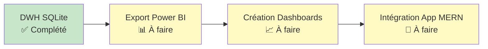

1. **Export vers Power BI** : Connexion du DWH à Power BI Desktop
2. **Création des Dashboards** : Visualisations interactives
3. **Intégration MERN** : Embedding des dashboards dans l'application SmartRide

---

## 📎 Annexes

### A. Structure des Dossiers

```
data-analytics-and-bi/
├── data/
│   ├── raw/
│   │   └── smartride_events_2025.csv
│   └── processed/
│       ├── smartride_dwh_ready.csv
│       └── smartride_dwh.db
├── SmartRide_ETL_PowerBI.ipynb
└── RAPPORT_ETL_DWH_SmartRide.md
```

### B. Glossaire

| Terme | Définition |
|-------|------------|
| **ETL** | Extract, Transform, Load - Processus d'intégration de données |
| **DWH** | Data Warehouse - Entrepôt de données |
| **Star Schema** | Modèle en étoile - Architecture de DWH |
| **Dimension** | Table de contexte (qui, quoi, où, quand) |
| **Fait** | Table centrale avec les mesures/métriques |
| **Surrogate Key** | Clé de substitution numérique auto-générée |
| **IQR** | Interquartile Range - Méthode de détection d'outliers |
| **KPI** | Key Performance Indicator - Indicateur clé de performance |

---

*Rapport- SmartRide BI Project - Janvier 2026*
